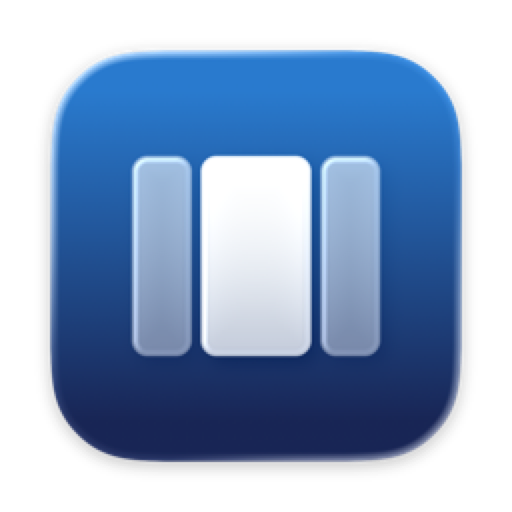

<div align="center">
  
  <h1><b>Colonnade</b></h1>
  <p>Horizontal window management for wide screens.<br>
  <a href="https://github.com/niels-hop/Colonnade/releases/latest/download/Colonnade.zip"><strong>Download for macOS »</strong></a><br>
  <i>macOS 13 or later · free and open source (GPL-3.0)</i></p>
</div>

Colonnade arranges your windows side by side as full-height columns. You hold two keys and move the mouse, and that's the whole app.

It is built for super-ultrawide monitors (32:9 and wider), where half and quarter tiles stop making sense. It works just as well on a MacBook's built-in display.

## How it works

1. **Hold the trigger** (by default <kbd>fn</kbd>; many people use <kbd>⌃</kbd> + <kbd>⌥</kbd>). The **dock** appears: a live miniature of your screen with the windows that are already there.
2. **Move the mouse sideways** to pick a spot:
   - **empty space** fills the gap,
   - **the edge of a window** inserts the new window next to it, and the neighbours make room,
   - **the middle of a window** stacks on top of it at the same width.
3. **Click** to cycle through widths (½ → ⅓ → ¼ by default). **Scroll** to fine-tune. **Drag a divider** to resize two neighbours at once. **Move down** into the lower lane to place a window freely.
4. **Release** to place the window. <kbd>Esc</kbd> cancels.

Windows always span the full height of the screen. Colonnade only divides the horizontal space: no vertical splits and no quarter tiles.

## Features

- **The dock**: a screen-shaped minimap that shows existing windows, dividers and a live preview of where the window will go.
- **Stacks and dividers**: windows at exactly the same position form a stack. Dragging a divider resizes the columns on both sides.
- **Saved layouts**: save your arrangement to one of three slots (Work, Focus, MacBook) and restore it from the menu bar. It can also restore automatically at login, after wake, or when displays or Spaces change.
- **Works on any screen**: by default the dock is used everywhere. Switch to *Automatic* to use it only on wide screens, with a configurable aspect-ratio threshold, and fall back to a radial menu elsewhere.
- **Tweakable**: dock size, pointer sensitivity, the click width cycle, padding, animations, accent colour, excluded apps and more, all in Settings.
- **Keyboard shortcuts**: every window action from Loop's engine is still available as a keybind.

## Install

1. Download [`Colonnade.zip`](https://github.com/niels-hop/Colonnade/releases/latest/download/Colonnade.zip), unzip it and move **Colonnade.app** to **/Applications**.
2. Releases are not notarised by Apple, so macOS blocks the first launch. Open the app once, then go to **System Settings → Privacy & Security** and click **Open Anyway**. You can also clear the quarantine flag from Terminal:
   ```bash
   xattr -dr com.apple.quarantine /Applications/Colonnade.app
   ```
3. Grant **Accessibility** access when asked: System Settings → Privacy & Security → Accessibility → Colonnade.
   Each macOS user account grants this separately.

> [!NOTE]
> Release builds are ad-hoc signed. After you replace the app with a newer version, macOS no longer recognises it, so Colonnade asks for Accessibility access again. Remove the old Colonnade entry from the list and enable the new one.

Colonnade checks GitHub once a day for a new release and tells you when one is out. You can turn this off under Settings → About. It never installs anything by itself.

## Building from source

Requirements: Xcode 26 or later, macOS 13 or later.

```bash
git clone https://github.com/niels-hop/Colonnade.git
cd Colonnade
xcodebuild -project Colonnade.xcodeproj -scheme Colonnade -configuration Debug -skipMacroValidation build
```

`-skipMacroValidation` is needed on the command line because a dependency (Scribe) ships a Swift macro. In Xcode, you approve it once.

By default builds are **ad-hoc signed**. macOS then forgets the Accessibility permission after every rebuild. To avoid that, create a stable self-signed certificate once:

1. Open **Keychain Access → Certificate Assistant → Create a Certificate…**
2. Name: `Colonnade Self-Signed` · Identity Type: *Self Signed Root* · Certificate Type: *Code Signing*
3. Create `Colonnade/Local.xcconfig` (it is gitignored) containing:
   ```
   CODE_SIGN_IDENTITY = Colonnade Self-Signed
   ```

`scripts/deploy.sh` builds a Release, installs it into `/Applications` and verifies the signature.

## Coming from Loop?

Colonnade is a separate app with its own bundle identifier (`com.nielshop.Colonnade`), so it can sit next to Loop. Don't run both at once with the same trigger key. Settings from the earlier personal build of this fork (`com.nielshop.Loop`) are imported automatically on first launch. Keybinds exported from Loop can be imported under Settings → Advanced.

## Credits and license

Colonnade is a fork of **[Loop](https://github.com/MrKai77/Loop)** by [Kai Azim](https://github.com/MrKai77) and contributors. Its window engine, settings framework ([Luminare](https://github.com/MrKai77/Luminare)) and much more come from Loop. Thank you!

Like Loop, Colonnade is licensed under the **GNU General Public License v3.0**; see [LICENSE](LICENSE). Source files that come from Loop keep their original author headers.
